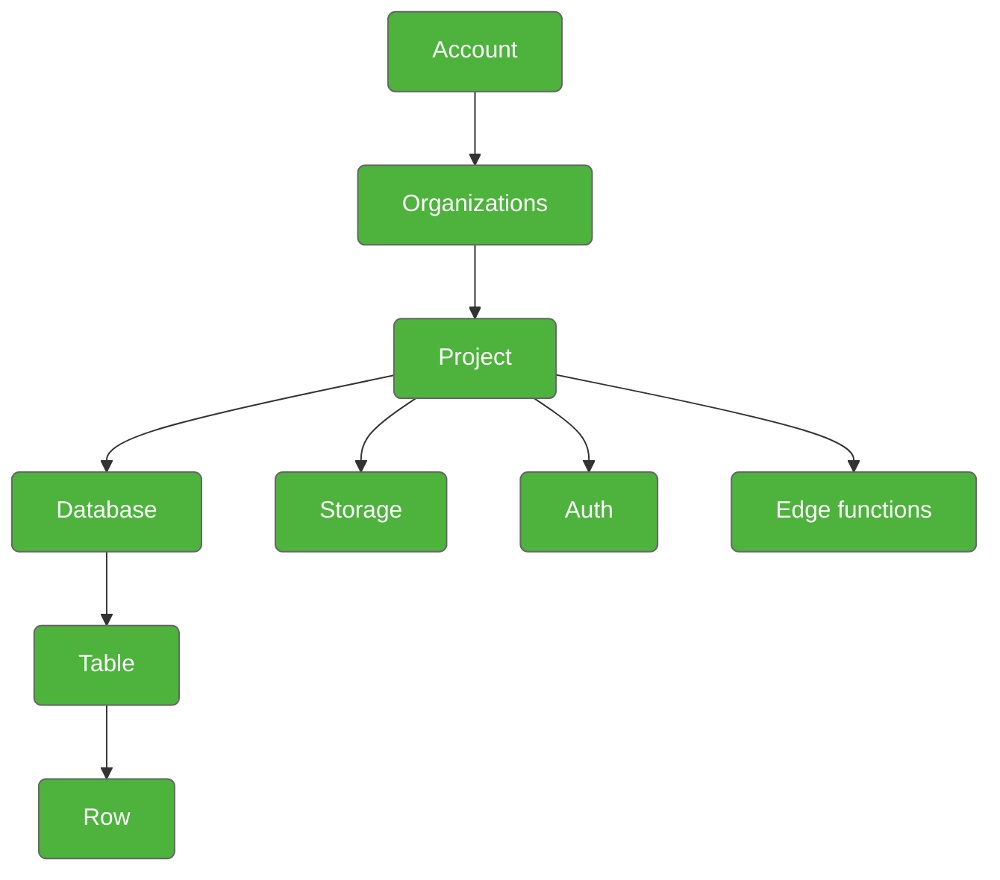

# Supabase System Documentation

## System Hierarchy Diagram

## Component Descriptions

### Account
- The top-level entity in Supabase
- Represents a user account that can manage multiple organizations
- Contains all personal settings, billing information, and access controls

### Organizations
- A container for multiple projects
- Enables team collaboration and project management
- Can have multiple team members with different roles and permissions
- Handles billing and resource allocation across projects

### Project
- A standalone instance of Supabase services
- Contains its own database, storage, and authentication systems
- Has unique API keys and configuration settings
- Can be developed and deployed independently

### Core Services

#### Database
- PostgreSQL database instance
- Stores structured data
- Handles queries and data operations
- Supports real-time subscriptions
- Includes built-in row level security

#### Storage
- Object storage system for large files
- Handles media files, documents, and other binary data
- Integrated with database for metadata management
- Includes access control and bucket organization

#### Auth
- Authentication and authorization system
- Manages user sessions and JWT tokens
- Supports multiple auth providers (OAuth, email, phone, etc.)
- Handles user management and security policies

#### Edge Functions
- Serverless functions deployed globally
- Runs custom backend logic
- Handles API requests and data processing
- Supports multiple runtime environments

### Data Structure

#### Table
- Database table structure
- Defines schema and relationships
- Contains columns with data types
- Implements policies and constraints

#### Row
- Individual data record
- Contains field values
- Subject to table policies
- Basic unit of data storage

## Usage Guidelines

1. Start by creating an account and organization
2. Set up projects for different applications or environments
3. Configure core services based on project requirements
4. Create and manage database tables
5. Implement security policies and access controls
6. Deploy edge functions as needed

This hierarchy ensures clear separation of concerns and scalable application architecture while maintaining security and performance across all levels.